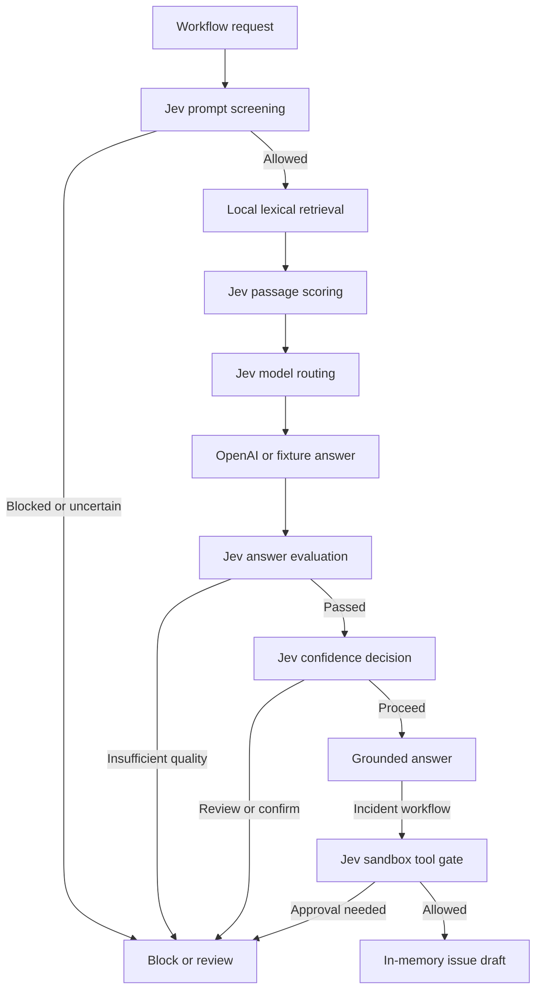

# ⚡ Jev DecisionOps v2 — Executable decision orchestration

A runnable, interview-focused demonstration of six decision use cases using **TypeSafe AI Jev** as the decision engine. The default mode calls the **live Jev API**; fixture mode is explicitly marked as simulated and never described as a real model output.

Version 2 adds a multi-step workflow API and dashboard: local retrieval → Jev passage scoring → model-tier routing → optional OpenAI generation → answer evaluation → confidence gating → sandbox remediation drafts.

## Architecture and six use cases


> **Diagram scope:** The refined diagram summarizes the six decision primitives and deterministic policy boundary. v2 implements local lexical retrieval, an optional OpenAI generation adapter, in-memory remediation drafts, and per-stage traces. Vector databases, externally executed tools, observability backends, and a real human approval service remain future integrations. The image is an architectural overview, not proof of credentialed live execution.

## Start (Python 3.10+, zero pip dependencies)

```bash
export TYPESAFE_API_KEY='YOUR_TYPESAFE_KEY'
python app.py
# Open http://localhost:8765
```

The configured endpoint defaults to `https://api.typesafe.ai/v1/systemone` with `model: jev-latest`. Override `JEV_ENDPOINT` if your TypeSafe account specifies a different endpoint. The API shape is `{"model":"jev-latest", "state":"...", "questions":{"question_name":{"type":"choice|score|noul", ...}}}`. Keys stay server-side. Check endpoint/schema against your TypeSafe account's documentation before live demonstrations.

To rehearse **without a Jev key** (no real inference):

```bash
JEV_MODE=fixture python app.py
```

## Workflows

The six single-decision scenarios remain available. The v2 orchestration endpoint composes these decisions with retrieval, optional generation, evaluation and sandbox actions.

| Workload | Jev primitive | Downstream action |
|---|---|---|
| LLM model selection | choice | small / medium / large LLM tier (selection only) |
| Prompt screening | choice | allow / review / block |
| Tool-call risk | choice | allow-if-authorized / approve / deny; hardcoded deny-list always wins |
| Passage reranking | score | ordinal passage relevance (single passage demo) |
| Answer evaluation | score + noul | answer quality and grounding signals |
| Confidence-driven autonomy | choice + confidence | proceed / confirm / human review |

## System boundary



**Not implemented:** published GitHub issues or production tool actions, vector retrieval infrastructure, a human approval service, distributed tracing, or production access control. Live OpenAI inference is implemented as an optional adapter; credentialed live end-to-end execution remains unverified. The demo does not manufacture evidence of these integrations. Before production: validate Jev's response contract and confidence scales against your account, create labeled datasets, measure per-task precision/recall and calibration, add authentication and RBAC, secret management, audit retention, retries, monitoring, and human-review queues.

## Interview narration (5–7 min)

1. Show the decision boundaries and distinction between Jev and generative LLMs.
2. Run prompt routing (safe input), then a prompt injection against guardrails.
3. Run a destructive `github.delete_repository` request: even if the classifier were wrong, application policy blocks it.
4. Score retrieved context; evaluate a generated response against a reference.
5. Show confidence escalation and inspect the complete typed input/output trace.
6. Compare real latency and spend only after collecting reliable live benchmarks. Do **not** claim 10–100× savings based on fixtures.

## API source references

- https://www.jevtypesafeai.com/how-to-use (community guide reproducing official endpoint shape)
- https://www.jevtypesafeai.com/jev/api (community API guide)

**Note:** Community documentation may differ from your actual TypeSafe account's contract. The default endpoint has not been tested with a real key by this repository author.

## Executable orchestrated workflows (v2)

The new `orchestration.py` adds **local lexical retrieval**, Jev-based per-passage scoring, Jev LLM-tier selection, an optional real OpenAI LLM call, Jev answer evaluation, fail-closed outcome escalation, and a **sandbox-only** remediation-issue drafting tool. It emits a per-stage structured trace. This is an executable orchestration pipeline, **not** a production deployment.

```bash
# All Jev outputs are fixed fixtures (guardrails intentionally block input)
JEV_MODE=fixture LLM_MODE=fixture python app.py
# Use the new POST /api/workflow endpoint, for instance:
curl -s localhost:8765/api/workflow -H 'Content-Type: application/json' \
  -d '{"question":"How to rollback a failed deployment?","scenario":"rag_answer"}'

# Live Jev + live OpenAI (requires verified Jev endpoint/response contract)
TYPESAFE_API_KEY=... OPENAI_API_KEY=... JEV_MODE=live LLM_MODE=openai python app.py
```

**Important:** Fixture mode deliberately uses the same fixed high-risk guardrail response from v1 and therefore blocks workflows at that stage; successful path is verified by **mocking Jev outputs in integration tests**. A realistic offline simulator is not shipped. Jev response format and credentialed live E2E were not independently verified. The local lexical retriever is not vector RAG. Drafted issues are in-memory artifacts, not GitHub tickets. `write_local_report` is restricted to a sandbox folder and requires explicit approval; no destructive operations are enabled.

Tests: `python -m unittest -v`. The authenticated live path requires API credentials and external network access. Never commit credentials.

### Orchestration policy details

For an approved response, Jev evaluates answer quality and grounding, then provides a **confidence decision** which must pass the deterministic `PROCEED` threshold; low scores or uncertain decisions escalate without returning the drafted answer. In the incident scenario, Jev additionally assesses the sandbox draft tool, and a deterministic allowlist enforces the final action. All stages appear in the audit trace. CI runs all 11 isolated tests with no API credentials; live service calls are stubbed in successful-path tests.

`GET /health`, `GET /api/scenarios`, `POST /api/decide` (single decision) and `POST /api/workflow` (multi-step workflow) are available. The server binds to `127.0.0.1` by default and is not designed to be internet-exposed. No real human approval backend, vector database, persistent trace store, or production authorization layer is included. For deployment, add authentication, rate limiting, secret management, prompt-injection robustness tests, schema validation, and durable audit storage.
