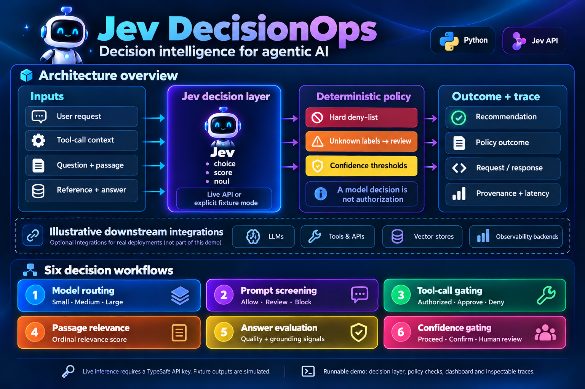

# ⚡ Jev DecisionOps — Six real-world decision-model workflows

A runnable, interview-focused demonstration of six decision use cases using **TypeSafe AI Jev** as the decision engine. The default mode calls the **live Jev API**; fixture mode is explicitly marked as simulated and never described as a real model output.

## Architecture and six use cases



> **Diagram scope:** Refined from the supplied diagram. The solid architecture shows the implemented decision layer, deterministic policy checks, dashboard outcomes, and inspectable traces. The dashed section shows optional downstream integrations: LLMs, tools and APIs, vector stores, and observability backends. Those integrations are illustrative and are not shipped by this demo. Live inference requires a TypeSafe API key; offline fixtures are explicitly simulated.

## Start (Python 3.10+, zero pip dependencies)

```bash
export TYPESAFE_API_KEY='YOUR_TYPESAFE_KEY'
python app.py
# Open http://localhost:8765
```

The configured endpoint defaults to `https://api.typesafe.ai/v1/systemone` with `model: jev-latest`. Override `JEV_ENDPOINT` if your TypeSafe account specifies a different endpoint. The API shape is `{"model":"jev-latest", "state":"...", "questions":{"question_name":{"type":"choice|score|noul", ...}}}`. Keys stay server-side. Check endpoint/schema against your TypeSafe account's documentation before live demonstrations.

To rehearse **without a Jev key** (no real inference):

```bash
JEV_MODE=fixture python app.py
```

## Validation

```bash
python -m unittest -v
```

The policy tests cover deterministic blocking, unknown classifications, confidence thresholds, and all six scenario definitions. Offline fixture outputs are fixed rehearsal examples and do not change with the input. Live inference requires a TypeSafe API key and has not been validated in this publishing session.

## Workflows

| Workload | Jev primitive | Downstream action |
|---|---|---|
| LLM model selection | choice | small / medium / large LLM tier (selection only) |
| Prompt screening | choice | allow / review / block |
| Tool-call risk | choice | allow-if-authorized / approve / deny; hardcoded deny-list always wins |
| Passage reranking | score | ordinal passage relevance (single passage demo) |
| Answer evaluation | score + noul | answer quality and grounding signals |
| Confidence-driven autonomy | choice + confidence | proceed / confirm / human review |

## System boundary

```
Browser → Python application → Jev decision API → typed answers
                             ↓
                   Deterministic policy evaluation
                             ↓
                     Outcome + inspectable trace
```

**Not implemented:** real GitHub/tool execution, LLM inference, retrieval infrastructure, human approval service, distributed tracing, production access control. The demo does not manufacture evidence of these integrations. Before production: validate Jev's response contract and confidence scales against your account, create labeled datasets, measure per-task precision/recall and calibration, add authentication and RBAC, secret management, audit retention, retries, monitoring, and human-review queues.

## Interview narration (5–7 min)

1. Show the decision boundaries and distinction between Jev and generative LLMs.
2. Run prompt routing (safe input), then a prompt injection against guardrails.
3. Run a destructive `github.delete_repository` request: even if the classifier were wrong, application policy blocks it.
4. Score retrieved context; evaluate a generated response against a reference.
5. Show confidence escalation and inspect the complete typed input/output trace.
6. Compare real latency and spend only after collecting reliable live benchmarks. Do **not** claim 10–100× savings based on fixtures.

## API source references

- https://www.jevtypesafeai.com/how-to-use (community guide reproducing official endpoint shape)
- https://www.jevtypesafeai.com/jev/api (community API guide)

**Note:** Community documentation may differ from your actual TypeSafe account's contract. The default endpoint has not been tested with a real key by this repository author.
